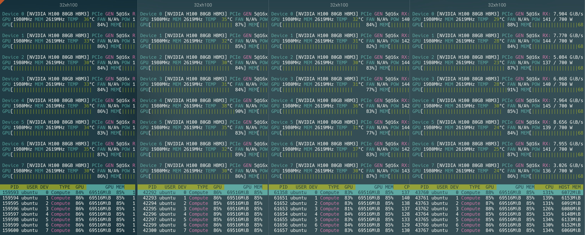
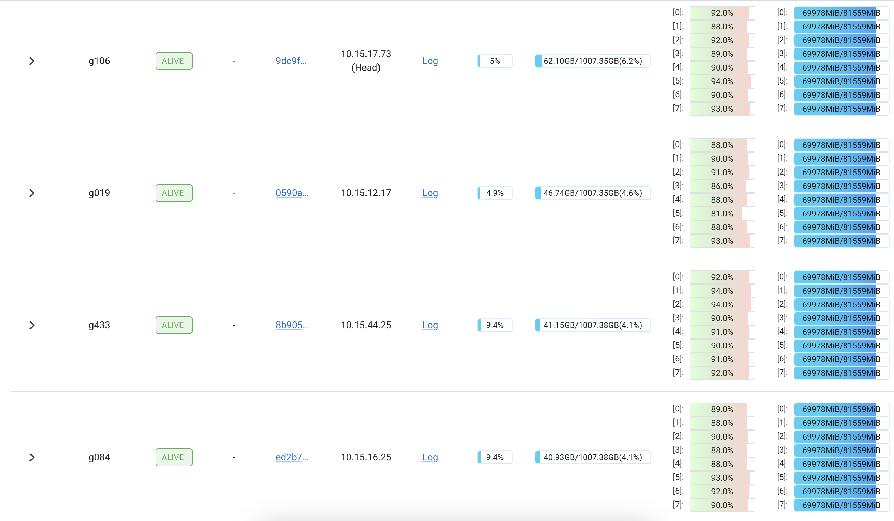
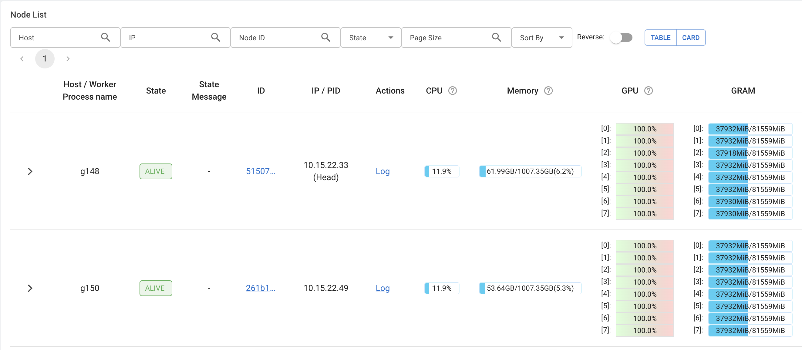
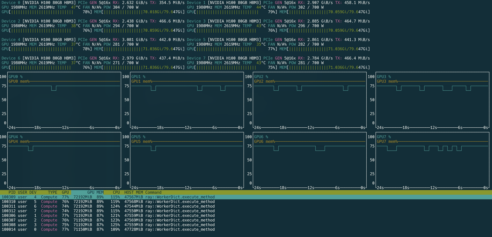
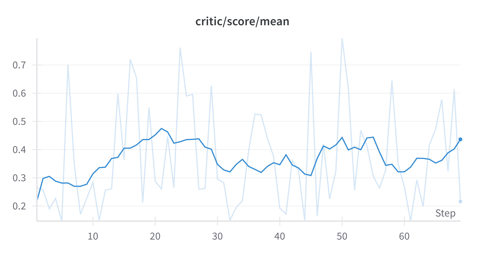

# 🤓 Terminal-Bench-RL: Training Long-Horizon Terminal Agents with Reinforcement Learning

**TL;DR:** 
- I successfully built stable RL training infrastructure that scales to 32x H100 GPUs across 4 bare metal nodes for training long-horizon terminal-based coding agents.
- In doing so, I developed Terminal-Agent-Qwen3-32b to become the **highest scoring Qwen3 agent on [terminal-bench](https://github.com/laude-institute/terminal-bench)**. WITHOUT training!:
    - Unfortunately I am too GPU poor to train a SOTA coding agent 😅 (£30k-£50k in compute required), but if anyone has the GPUs, this project should get you there!

This project builds upon the [rLLM framework](https://github.com/agentica-project/rllm) developed by UC Berkeley Sky Lab, extending it with custom environments and infrastructure specifically designed for terminal-based agent training.

## 📚 Table of Contents

- [💻💰 Training on $1M worth of compute](#-training-on-1m-worth-of-compute)
  - [Other training runs](#other-training-runs)
- [🏆 Placing a spot on the Terminal Bench Leaderboard](#-placing-a-spot-on-the-terminal-bench-leaderboard)
  - [🏗️ Action-Based Architecture](#️-action-based-architecture)
- [Training details](#training-details)
  - [⚖️ Reward Design](#️-reward-design)
  - [✅ Answer Verification (65% weight)](#-answer-verification-65-weight)
  - [🤖 LLM-as-a-Judge (35% weight)](#-llm-as-a-judge-35-weight)
    - [🧪 Judge Evaluation System](#-judge-evaluation-system)
    - [🔄 Dynamic LLM Judge Switching](#-dynamic-llm-judge-switching)
- [🏗️ rLLM Integration Architecture](#️-rllm-integration-architecture)
  - [Terminal Agent (`TerminalBenchAgent`)](#terminal-agent-terminalbenchagent)
  - [Docker Environment (`DockerIsolatedEnv`)](#docker-environment-dockerisolatedenv)
- [🔄 Training & Rollout Details](#-training--rollout-details)
  - [🔁 Rollout Strategy](#-rollout-strategy)
  - [⚙️ Training Configuration Presets](#️-training-configuration-presets)
  - [📊 Key Hyperparameters (Production Config)](#-key-hyperparameters-production-config)
- [🗂️ Dataset Details](#️-dataset-details)
  - [📊 Dataset Structure](#-dataset-structure)
  - [🐳 Training Environment Creation](#-training-environment-creation)
  - [🧹 Docker Resource Management](#-docker-resource-management)
  - [📂 Dataset Preparation Pipeline](#-dataset-preparation-pipeline)
- [🚀 Getting Started](#-getting-started)
  - [Development Setup](#development-setup)
  - [Terminal Bench Evaluation Reproduction](#terminal-bench-evaluation-reproduction)
  - [Training Deployment](#training-deployment)
    - [Single Node Training](#single-node-training)
    - [Multi-Node Training](#multi-node-training)
- [🔮 Future Improvements](#-future-improvements)
  - [🚀 Full Training Run](#-full-training-run)
  - [🤓 Curriculum learning](#-curriculum-learning)
  - [📊 Dataset Expansion](#-dataset-expansion)
  - [🎯 Smart Data Filtering](#-smart-data-filtering)
- [Acknowledgements](#acknowledgements)

---

## 💻💰 Training on $1M worth of compute
This image shows my training code running at full throttle on 32x H100's, distributed across a 4x bare metal node cluster, training Qwen3-32B. Thank you [Hyperbolic](https://hyperbolic.ai/) for such a streamlined experience! This was fun!




Due to the extreme cost of this level of compute, I was not able to run it forever! So I made sure it worked and also ran the code on less extravagent hardware setups too.

### Other training runs
I also ran Qwen3-32B training for longer on a 2x bare metal node cluster with 16x H100s:



Also 1 VM instance with 8x H100s:


My longest training run was using 2xA100s on a single VM instance, where I trained Qwen3-8B for over 60 steps:

Note: I did not expect the 8B to begin learning the complex behaviours required to solve the tasks in the dataset. However it was great to run the training through the dataset and ensure the code is stable.

## 🏆 Placing a spot on the Terminal Bench Leaderboard
[Terminal bench](https://www.tbench.ai/) is a benchmark created by Stanford and [Laude Institute](https://www.laude.org/) to quantify agents' ability to complete complex tasks in the terminal.

Through prompt engineering & custom tool design, my Qwen3-32B agent outperformed Stanford's Terminus-Qwen3-235B-30A MoE agent, as well as Deepseek R1 & OpenAI's GPT-4.1 with Codex agent, to become the highest scoring Qwen3 agent on the leaderboard. I am sure that with the compute budget for training, my agent would climb the leaderboard significantly.

My motivation behind this entire project was to place on the leaderboard of terminal bench by using RL to train a sophisticated LLM agent. In order to do so, I developed the tools (inspired by Claude Code) which a capable AI agent would use to help complete its task, as well as a system message which encouraged the agent to use those tools and approach the task in a specific way.

These tools can be found [here](./src/agent_core/env_components/) and include:
- **📝 Todo Management**: Planning and tracking task progress
- **📁 File Operations**: Read, write, and edit files
- **🔍 Search Tools**: Grep, glob, and ls for file exploration
- **⚡ Bash Execution**: Run terminal commands with output capture
- **🗒️ Scratchpad**: Space for note-taking
- **👍 Task Completion**: Signal when the agent believes the task is complete

Note: Technically the agent could have access to only the bash tool and would still have the same capabilites as all these tools above. Saving the development time and maintenance. However by providing clear APIs to specific tools, it enables the agent to understand and leverage tools much more effectively.

### 🏗️ Action-Based Architecture
The agent communicates through a structured XML/YAML format that ensures reliable parsing and execution:

```xml
<todo>
operations:
  - action: add
    content: "Find and analyze all Python test files"
  - action: add
    content: "Run pytest and fix any failing tests"
view_all: true
</todo>
```

```xml
<bash>
cmd: 'find . -name "*.py" -path "*/test*" | head -10'
timeout_secs: 30
</bash>
```

This architecture provides:
- **Type Safety**: Each action (bash, file, search, todo) has a dedicated handler with validation
- **Error Recovery**: Malformed YAML triggers helpful error messages guiding the agent to correct syntax
- **Sequential Execution**: Actions are processed one at a time with mandatory stop-and-wait behavior
- **Consistent Feedback**: Every action returns structured results the agent can learn from and adjust its plan

As well as developing these tools, I also wrote out a [system prompt](./src/agent_core/system_prompt.md) which encourages best practices such as:
- **Structured Task Execution**: Clear problem approach phases (Planning → Exploration → Execution → Verification)
- **Multi-Turn Interaction**: Action-environment cycle with proper stop-and-wait behavior
- **Mandatory Todo Management**: Required initial planning and continuous task tracking
- **Read-Only Exploration**: Gather information before making any changes

With this system message & tool combination + a capable LLM (I chose Qwen3-32B), I was able to place 19th on the terminal bench leaderboard with a score of 13.75%. This outperformed:
- Terminus agent with Qwen3-235B by Stanford
- Terminus agent with Deepseek-R1 by Stanford
- Codex agent with GPT-4.1 by OpenAI
- Codex agent with codex-mini by OpenAI

The agent can be seen [here](./evaluation/terminal_bench_eval/).

I would be extremely excited to see where Qwen3-32B would be on the leaderboard if I could afford to pay for the compute cost of a proper RL run!

---

## Training details

### ⚖️ Reward Design

To provide meaningful supervision during RL, rewards were computed using **two complementary methods**:

### ✅ Answer Verification (65% weight)
- Each training datapoint included Python unit tests to verify task completion
- Tests were assigned individual weights to provide granular partial credit
- Test execution ran in isolated Docker containers with configurable timeouts
- Weighted scoring: passed tests contributed their weight to the final test score

### 🤖 LLM-as-a-Judge (35% weight)
- Used **Claude-4-Sonnet** as an external judge to evaluate agent behavior
- Evaluated four primary components:
  - **Action Output Success (35%)**: Valid XML actions, successful parsing, error recovery
  - **Todo Usage & Planning (25%)**: Initial planning, task tracking, continuous updates
  - **Phase Adherence (25%)**: Following the 5-phase workflow (Planning → Exploration → Refinement → Execution → Verification)
  - **Tool Usage Effectiveness (15%)**: Appropriate tool selection, purposeful actions
- Applied quality modifiers for error recovery, discovery quality, and efficiency
- Penalized overthinking without action, gaming behaviors, and phase violations
- Scored on HOW the agent worked, not WHETHER the task was completed

#### 🧪 Judge Evaluation System
To ensure the LLM judge provided accurate and consistent scoring during RL training, I developed a simple [evaluation system](./evaluation/llm_as_a_judge_evals/):
- Created test cases showing different agent trajectories
- Tested 17 LLM models as judges including: Kimi K2, Qwen-3-Coder, Claude Sonnet 4, Claude Opus 4, Claude Haiku 3.5, OpenAi O3, GPT-4o, to compare scoring accuracy.
- Found Claude Sonnet 4 provided the most consistent and accurate scoring, correctly identifying issues like lack of exploration and overthinking
  - Unfortunately Sonnet-4 is extremely expensive, so it is not very affordable for a 32 rollout, 1650 step run! But it was the only model which understood a good from bad trajectory.
  - Many other models (including Haiku 3.5) gave inflated scores to problematic agent behaviors, with some scoring 0.85-0.95 for agents that skipped critical phases

To analyze judge model performance:
```bash
# Run evaluation on a specific model
uv run python evaluation/llm_as_a_judge_evals/judge_eval.py --model openrouter/openai/gpt-4.1 --attempts 3

# Generate performance report showing best models
uv run python evaluation/llm_as_a_judge_evals/report.py
```

**Top 5 Judge Models Performance:**

| Rank | Model | Pass Rate | Avg Score | 
|------|-------|-----------|-----------|
| 1 | Claude Sonnet 4 | 46.67% | **0.26** |
| 2 | Claude 3.5 Haiku | 46.67% | 0.70 |
| 3 | Qwen3 Coder | 26.67% | 0.76 |
| 4 | Devstral Medium | 23.33% | 0.50 |
| 5 | Kimi K2 | 23.33% | 0.53 |

Claude Sonnet 4 ranks #1 despite having the same pass rate as Haiku because its significantly lower average score (0.26 vs 0.70) indicates stricter, more accurate judging. Lower scores mean the model better identifies problematic agent behaviors that other judges miss.

Other models tested include: GPT-4.1, Gemma-3-27B-IT, Qwen3-32B, and Qwen3-235B-A22B.

#### 🔄 Dynamic LLM Judge Switching
To handle overloaded models, token limits or performance requirements during long training runs, the infrastructure supports hot-swapping between different LLM judge backends:
- **Runtime switching** without interrupting training process
- Switch between Claude Code CLI and LiteLLM backends as needed
- Useful when hitting API token limits or budget constraints
- See [`switch_judge_backend.py`](./training_scripts/switch_judge_backend.py) and [switching documentation](./docs/llm_judge_switching_readme.md)

Example workflow:
```bash
# Start with Claude Code CLI
python training_scripts/launch_training.py prod_32b_8_gpus

# Need to change? Switch to LiteLLM API (Can also proivde env vars to populate into training)
python training_scripts/switch_judge_backend.py litellm anthropic/claude-3-opus-20240229

# Later, switch back
python training_scripts/switch_judge_backend.py ccode
```


## 🏗️ rLLM Integration Architecture

This project extends [rLLM](https://github.com/agentica-project/rllm)'s `BaseAgent` and `BaseEnv` interfaces to create a complete RL training loop:

### Terminal Agent (`TerminalBenchAgent`)
- Extends rLLM's `BaseAgent` to manage multi-turn conversations between the environment and LLM
- Maintains conversation history with system prompt, user instructions, and agent responses
- Tracks complete trajectories with observations, actions, and rewards for GRPO training

### Docker Environment (`DockerIsolatedEnv`)  
- Extends rLLM's `BaseEnv` to provide isolated Docker containers for each training rollout
- Each rollout spawns a fresh container from the task's Dockerfile specification
- Executes agent actions through Docker, returning real terminal output as observations
- Computes rewards via software tests (65%) and LLM judge evaluation (35%)
- Ensures complete isolation between parallel rollouts for diverse solution exploration

The training loop follows rLLM's standard flow: reset → observation → LLM inference → action → environment step → reward → repeat. For some more details on this, see [`docs/rllm_specific/understanding_of_agents_and_envs.md`](./docs/rllm_specific/understanding_of_agents_and_envs.md).

## 🔄 Training & Rollout Details

This project leveraged **Group Relative Policy Optimization (GRPO)**, which encourages the model to learn from relative advantages within a group of sampled responses, making it particularly well-suited for structured reasoning tasks.

### 🔁 Rollout Strategy
- **16 samples per training prompt** (configurable), each generated with a **temperature of 1.2** to encourage diversity while maintaining coherence
- Complete trajectory isolation via Docker containers for each rollout

### ⚙️ Training Configuration Presets
The training infrastructure supports multiple hardware configurations through simple preset selection:

```bash
# Quick test run on 2x A100s
python training_scripts/launch_training.py test_8b_2_gpus

# Production run on 8x H100s
python training_scripts/launch_training.py prod_32b_8_gpus

# Scale to 32x H100s across 4 nodes
python training_scripts/launch_training.py prod_32b_4x8_h100
```

Available presets scale from development to production:
- **`test_8b_2_gpus`**: Quick validation with Qwen3-8B on 2x 80GB GPUs
- **`runway_32b_4_gpus`**: Standard training with Qwen3-32B on 4x GPUs
- **`prod_32b_8_gpus`**: Production setup on single 8x GPU node
- **`prod_32b_2x8_h100`**: Multi-node training on 16x H100s (2 nodes)
- **`prod_32b_4x8_h100`**: Full scale on 32x H100s (4 nodes)

### 📊 Key Hyperparameters (Production Config)
- **Algorithm**: GRPO with rejection sampling 
- **Learning Rate**: 1e-6 with gradient clipping (max norm = 0.1)
- **Batch Configuration**: Adaptive based on GPU count
- **Sequence Length**: 32,768 tokens max
- **Max single response Length**: 4,000 tokens per response
- **Training Duration**: 10 epochs through dataset
- **Parallelization**: Automatic tensor/sequence parallel sizing
- **Precision**: bfloat16 for efficiency
- **Monitoring**: WandB integration + detailed trajectory logging

The infrastructure automatically handles:
- Model distribution across GPUs with optimal tensor/sequence parallelism
- Memory optimization based on hardware (0.7-0.85 GPU utilization)
- Docker container lifecycle management for isolated rollouts
- Checkpoint saving and optional HuggingFace upload

## 🗂️ Dataset Details
As part of this repo are 331 training tasks, ranging from easy to extremely hard complexity.

> 🤓🤖 I developed a comprehensive multi-agent synthetic data pipeline powered by Claude Code + Opus-4 to generate and **(importantly)** validate each datapoint. The repo for this framework can be found [here](https://github.com/Danau5tin/tbench-agentic-data-pipeline)!

### 📊 Dataset Structure
Each training datapoint in `dataset/latest_verified.csv` contains:

```python
{
    "task_id": "git-deployment-workflow-setup",    # Unique task identifier
    "difficulty": "hard",                          # easy|medium|hard|extremely_hard
    "category": "system-administration",           # Task category
    "prompt": "I need help setting up a simple CI/CD system...",  # The actual task instruction
    "dockerfile": "FROM ghcr.io/laude-institute/t-bench/ubuntu-24-04:latest\n...",  # Docker environment setup
    "test_functions": "def test_hook_script_executable():\n    ...",  # Pytest verification code
    "test_weights": {                              # Weight for each test (for partial credit)
        "test_hook_script_executable": 0.35,
        "test_nginx_service_running": 0.15,
        "test_deployment_works_correctly": 0.50
    },
    "additional_files": {                          # Optional files to include in container
        "backup_config.json": "{\n  \"schedules\": [...",
        "collision_detector.py": "#!/usr/bin/env python3\n..."
    }
}
```

### 🐳 Training Environment Creation
During training, each task generates multiple parallel rollouts (trajectories), with each rollout executed in complete isolation:

1. **Parallel Rollout Generation**: 
   - **N_ROLLOUTS**: Configurable per training preset (e.g., 4 for test runs, 16 for production)
   - Each rollout runs simultaneously in its own Docker container
   - Complete independence between rollouts allows diverse solution exploration

2. **Per-Rollout Environment Setup**:
   - New Docker container created using the task's `dockerfile`
   - Container starts with a clean filesystem based on the Dockerfile
   - Any `additional_files` are written to the container before the agent begins
   - Agent receives the task `prompt` as its initial instruction

3. **Agent Execution**: The agent interacts with its isolated environment using tools (bash, file operations, etc.)

4. **Verification**: After completion, `test_functions` are executed to compute the test score

5. **Cleanup**: Container is destroyed after trajectory completion

### 🧹 Docker Resource Management
Due to the high volume of Docker containers being created (up to 24 containers running in parallel during training), the infrastructure includes automatic resource cleanup:
- **Automatic cleanup daemon** periodically removes stopped containers and unused networks
- Runs every 2 minutes to prevent resource exhaustion
- Immediate cleanup on training startup to ensure clean environment
- See [`docker_cleanup.py`](./src/tbench_rllm/docker_cleanup.py) and [`docker_env.py`](./src/tbench_rllm/docker_env.py) for cleanup implementation details

### 📂 Dataset Preparation Pipeline
The training data flows through a multi-stage preparation pipeline before being used by rLLM:

1. **CSV Dataset** (`dataset/latest_verified.csv`): Contains task definitions with prompts, Dockerfiles, test functions, and weights

2. **Terminal Bench Tasks** (via `convert_dataset_to_tasks.py`):
   - Converts each CSV row into a Terminal Bench task directory structure in order to leverage the TerminalBench Docker harness and unit test runner + parser for reward calculation during RL run.
   - Runs in parallel to speed up conversion of tasks

3. **Parquet Format** (via `tasks_to_parquet_converter.py`):
   - Creates `data/terminal_bench/*.parquet` files for rLLM's data loader
   - Each row contains `extra_info` dict with: task_name, task_path, instruction, test_weights, dockerfile_contents, etc.
   - This `extra_info` is passed to `DockerIsolatedEnv.from_dict()` during training to create environments


## 🚀 Getting Started

### Development Setup
Clone the repository and install dependencies:
```bash
git clone --recurse-submodules https://github.com/Danau5tin/terminal-bench-rl.git
cd terminal-bench-rl
uv sync
```

That's it! UV will handle all dependencies automatically.

> **Note**: This project includes a forked version of the terminal-bench repository with the Python version requirement reduced from 3.13 to 3.12 for compatibility.

### Terminal Bench Evaluation Reproduction
After setup, you can reproduce my Terminal Bench evaluation results:
```bash
# Set environment variables, example:
export LITE_LLM_API_KEY="your_huggingface_token"
export LITE_LLM_API_BASE="https://router.huggingface.co/v1"
export LITELLM_MODEL="openai/Qwen/Qwen3-32B:nebius"

# Run the evaluation
./evaluation/terminal_bench_eval/run_eval.sh
```

This will run the agent with the same configuration that achieved 13.75% on the leaderboard.

### Training Deployment

#### Single Node Training
For detailed single-node training setup:
- See [Single Node Training Guide](./docs/single_node_training_walkthrough.md)

#### Multi-Node Training  
For distributed training across multiple nodes:
- See [Multi-Node Training Guide](./docs/multi_node_training_walkthrough.md)

---

## 🔮 Future Improvements

Given more time and resources, several enhancements would further improve training effectiveness:

### 🚀 Full Training Run
At this point, I feel as if I have created a great cake recipe, put everything in place to make it, and yet I can't afford to pay for the oven!!! 😂
- With sufficient compute budget, I'd run full training and then evaluate the trained model. I am confident that it would outperform the untrained Qwen3-32B.

### 🤓 Curriculum learning
- I'd also implement curriculum learning to progressively increase task difficulty, starting with easy and medium tasks, with a high weight on the judge reward to encourage behaviour such as using todo list, etc.
- Then when these easier tasks are being completed with the correct behaviour, I would remove the judge completely, and move to 100% software verification of the tasks. Allowing the model to lose the strict constraints of what it learnt at first, and explore optimised routes to success from a principled base.

### 📊 Dataset Expansion
- **Generate more datapoints**: Currently I have only ~331 tasks due to time constraints
- A larger dataset (1000+ tasks) would provide more diverse scenarios and tech stacks for robust training
- I'd also take the time to give each datapoint careful validation, which takes time but ensures quality

### 🎯 Smart Data Filtering
- **Pre-filter trivial datapoints**: Before training, I'd run the untrained model on all tasks
- I'd remove datapoints where the model achieves zero or perfect scores (0.0 or 1.0 reward)
- This would save GPU time by focusing training on tasks where the model can actually learn

---

## Acknowledgements 
- I want to thank everyone who contributed to Terminal Bench, it is a great benchmark and just what I've been looking for!
- A big thank you to the minds behind rLLM too! I did try this with other training frameworks, and they contained critical bugs which are not solved today, so it was a breath of fresh air to use a framework that performed so well!
- A thank you for the Claude Code team for inspiring the tool use and agent behavioural approach used in this project!
- A big thank you to the research team at Anthropic, for creating such great models. Opus-4 assisted me heavily in this project, especially when debugging problems on deployed clusters of distributed GPUs.

This project was a lot of fun! Thanks for reading!
Dan

